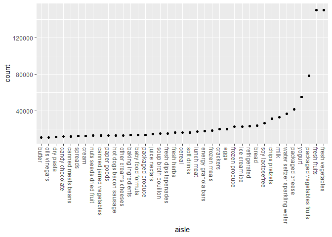

Homework 3 - Visualization and EDA
================
Sydney Ng (uni: sn2863)
due 10/10/2020 by 10:00 pm EDT

``` r
library(tidyverse)
```

    ## -- Attaching packages ------------------------------------------------ tidyverse 1.3.0 --

    ## v ggplot2 3.3.2     v purrr   0.3.4
    ## v tibble  3.0.3     v dplyr   1.0.2
    ## v tidyr   1.1.2     v stringr 1.4.0
    ## v readr   1.3.1     v forcats 0.5.0

    ## -- Conflicts --------------------------------------------------- tidyverse_conflicts() --
    ## x dplyr::filter() masks stats::filter()
    ## x dplyr::lag()    masks stats::lag()

``` r
library(p8105.datasets)
```

## Problem 1 - Instacart data

``` r
data("instacart") # loading in the data set
```

This data set contains 1384617 number of observations and 15 variables.

Observations are the level of items in orders by users. In the data set,
there are user and order variables, including user ID, order ID, order
day, and order hour. Other variables are aisles with corresponding aisle
ID, which belong to product departments.

#### How many aisles and which are the most from?

``` r
aisle_distinct <- 
  instacart %>%
  group_by(aisle) %>%
  summarize(count = n()) %>%
  arrange(desc(count))
```

    ## `summarise()` ungrouping output (override with `.groups` argument)

``` r
nrow(aisle_distinct) # there are 134 different aisles
```

    ## [1] 134

#### Let’s make a plot\!

``` r
aisle_distinct %>%
  filter(count > 10000) %>%
  mutate(aisle = factor(aisle),
         aisle = fct_reorder(aisle,count)) %>%
  ggplot(aes(x = aisle, y = count)) + 
  geom_point() +
  theme(axis.text.x = element_text(angle = 270, vjust=0.5, hjust=0))
```

<!-- -->

Table showing the three most popular items in each of the aisles “baking
ingredients”, “dog food care”, and “packaged vegetables fruits”. Include
the number of times each item is ordered in your table.

``` r
popular_items <-
  instacart %>%
  filter(aisle %in% c("baking ingredients", 
                      "dog food care", "packaged vegetables fruits")) %>%
  group_by(aisle) %>%
  count(product_name) %>%
  mutate(rank = min_rank(desc(n))) %>%
  filter(rank < 4) %>%
  arrange(aisle, rank)

popular_items
```

    ## # A tibble: 9 x 4
    ## # Groups:   aisle [3]
    ##   aisle                    product_name                                  n  rank
    ##   <chr>                    <chr>                                     <int> <int>
    ## 1 baking ingredients       Light Brown Sugar                           499     1
    ## 2 baking ingredients       Pure Baking Soda                            387     2
    ## 3 baking ingredients       Cane Sugar                                  336     3
    ## 4 dog food care            Snack Sticks Chicken & Rice Recipe Dog T~    30     1
    ## 5 dog food care            Organix Chicken & Brown Rice Recipe          28     2
    ## 6 dog food care            Small Dog Biscuits                           26     3
    ## 7 packaged vegetables fru~ Organic Baby Spinach                       9784     1
    ## 8 packaged vegetables fru~ Organic Raspberries                        5546     2
    ## 9 packaged vegetables fru~ Organic Blueberries                        4966     3

Another table for Pink Lady Apples versus Coffee Ice Cream

``` r
apples_icecream <-
  instacart %>%
  filter(product_name == "Pink Lady Apples" | product_name == "Coffee Ice Cream") %>%
  group_by(product_name, order_dow) %>%
  summarize(mean_hour = mean(order_hour_of_day)) %>%
  pivot_wider(names_from = order_dow, values_from = mean_hour)

apples_icecream # deliberately untidy the data set -- long to wide format
```

    ## # A tibble: 2 x 8
    ## # Groups:   product_name [2]
    ##   product_name       `0`   `1`   `2`   `3`   `4`   `5`   `6`
    ##   <chr>            <dbl> <dbl> <dbl> <dbl> <dbl> <dbl> <dbl>
    ## 1 Coffee Ice Cream  13.8  14.3  15.4  15.3  15.2  12.3  13.8
    ## 2 Pink Lady Apples  13.4  11.4  11.7  14.2  11.6  12.8  11.9

## Problem 2

``` r
accel_df <- 
  read_csv("./accel_data.csv") %>%
  pivot_longer(4:1443, names_to = "activity", values_to = "activity_minutes",
               names_prefix = "activity.") %>%
  mutate(weekend_weekday = if_else(day == "Saturday" | 
                                     day == "Sunday", "Weekend", "Weekday"),
         activity = as.numeric(activity),
         day = factor(day)) # changing chr to numeric class

days_of_week <- tibble(day_num = 1:7,
                       day_name = c("Monday", "Tuesday", "Wednesday", "Thursday",
                                    "Friday", "Saturday", "Sunday"))

accel_df <-
  left_join(accel_df, days_of_week, by = c("day" = "day_name"))
```

After cleaning the `accel_data.csv` we have 50400 observations in the
data set and 7 variables. I also noticed that the days of the week in
the dataset are out of order, so Monday was made the first day of the
week, while Sunday was made the last day of the week.

#### Aggregating across minutes to create a total activity variable for each day, and create a table showing these totals

``` r
accel_day_df <-
  accel_df %>%
  group_by(week, day_num, day) %>%
  summarize(total_day_activity = sum(activity_minutes))

accel_day_df # printing out the table; 35 observations
```

    ## # A tibble: 35 x 4
    ## # Groups:   week, day_num [35]
    ##     week day_num day       total_day_activity
    ##    <dbl>   <int> <chr>                  <dbl>
    ##  1     1       1 Monday                78828.
    ##  2     1       2 Tuesday              307094.
    ##  3     1       3 Wednesday            340115.
    ##  4     1       4 Thursday             355924.
    ##  5     1       5 Friday               480543.
    ##  6     1       6 Saturday             376254 
    ##  7     1       7 Sunday               631105 
    ##  8     2       1 Monday               295431 
    ##  9     2       2 Tuesday              423245 
    ## 10     2       3 Wednesday            440962 
    ## # ... with 25 more rows

  - Looking at the table I created, it seems like daily activity
    generally increases throughout the weekdays especially looking at
    weeks 1, 2, and 5. There is not as much of this trend in weeks 3 and
    4. The lowest total activity in minutes are on a Saturday in weeks 4
    and 5. However “apparent” these trends are, it would be of interest
    to visualize these with a plot or with further descriptive
    statistics.

#### Single-Panel Plot with 24-hour activity time courses

``` r
# accel_day_plot <-
#   accel_day_df %>%
#   group_by(week, day_num) %>%
#   ggplot(aes(x=day, y=total_day_activity)) + geom_point(aes(color = week))
```

## Problem 3

``` r
data("ny_noaa")
noaa_df <-
  ny_noaa %>%
  separate(date, c("year", "month", "day"), convert = TRUE) %>%
  mutate(tmax_C = as.numeric(tmax)*10, # changing tenths of degrees C to degrees C
         tmin_C = as.numeric(tmin)*10,
         prcp_mm = prcp*10) %>% # changing precipitation tenths of mm to mm
  select(-tmax, -tmin, -prcp)
```

After cleaning the `ny_noaa` data set we have 2595176 observations in
the data set and 9 variables. The data set contains information for all
New York State weather stations from January 1, 1981 to December 31,
2010 with variables for Weather Station ID, precipitation, snowfall,
snow depth, and the max and min temperatures. There are quite a bunch of
NAs because not every weather station collects all data and may only
report a subset of these variables.

``` r
snow_count <-
  noaa_df %>%
  group_by(snow)%>%
  summarize(count = n()) %>%
  arrange(desc(count))

head(snow_count)
```

    ## # A tibble: 6 x 2
    ##    snow   count
    ##   <int>   <int>
    ## 1     0 2008508
    ## 2    NA  381221
    ## 3    25   31022
    ## 4    13   23095
    ## 5    51   18274
    ## 6    76   10173

  - For the `snow` variable for snowfall (mm), the most commonly
    observed values are 0. This makes sense because it really only snows
    around the winter time, which would take up approximately one-fourth
    of the days in the year. Therefore, the other three-fourths of the
    year, there would be 0 snowfall.
