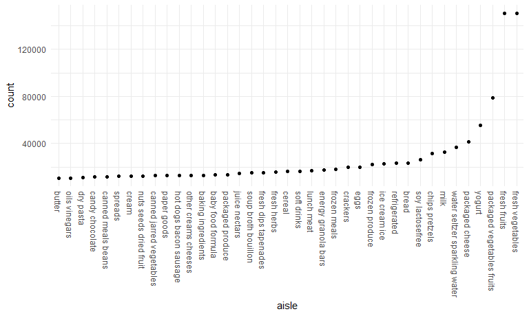

Homework 3 - Visualization and EDA
================
Sydney Ng (uni: sn2863)
due 10/10/2020 by 10:00 pm EDT

``` r
library(tidyverse)
```

    ## -- Attaching packages ------------------------------------------------ tidyverse 1.3.0 --

    ## v ggplot2 3.3.2     v purrr   0.3.4
    ## v tibble  3.0.3     v dplyr   1.0.2
    ## v tidyr   1.1.2     v stringr 1.4.0
    ## v readr   1.3.1     v forcats 0.5.0

    ## -- Conflicts --------------------------------------------------- tidyverse_conflicts() --
    ## x dplyr::filter() masks stats::filter()
    ## x dplyr::lag()    masks stats::lag()

``` r
library(p8105.datasets)
```

## Problem 1 - Instacart data

``` r
data("instacart") # loading in the data set
```

This data set contains 1384617 number of observations and 15 variables.

Observations are the level of items in orders by users. In the data set,
there are user and order variables, including user ID, order ID, order
day, and order hour. Other variables are aisles with corresponding aisle
ID, which belong to product departments.

#### How many aisles and which are the most from?

``` r
aisle_distinct <- 
  instacart %>%
  group_by(aisle) %>%
  summarize(count = n()) %>%
  arrange(desc(count))
```

    ## `summarise()` ungrouping output (override with `.groups` argument)

``` r
nrow(aisle_distinct) # there are 134 different aisles
```

    ## [1] 134

#### Let’s make a plot\!

``` r
aisle_distinct %>%
  filter(count > 10000) %>%
  mutate(aisle = factor(aisle),
         aisle = fct_reorder(aisle,count)) %>%
  ggplot(aes(x = aisle, y = count)) + 
  geom_point() +
  theme(axis.text.x = element_text(angle = 270, vjust=0.5, hjust=0))
```

<!-- -->

Table showing the three most popular items in each of the aisles “baking
ingredients”, “dog food care”, and “packaged vegetables fruits”. Include
the number of times each item is ordered in your table.

``` r
popular_items <-
  instacart %>%
  filter(aisle %in% c("baking ingredients", 
                      "dog food care", "packaged vegetables fruits")) %>%
  group_by(aisle) %>%
  count(product_name) %>%
  mutate(rank = min_rank(desc(n))) %>%
  filter(rank < 4) %>%
  arrange(aisle, rank)
```

Another table for Pink Lady Apples versus Coffee Ice Cream

``` r
apples_icecream <-
  instacart %>%
  filter(product_name == "Pink Lady Apples" | product_name == "Coffee Ice Cream") %>%
  group_by(product_name, order_dow) %>%
  summarize(mean_hour = mean(order_hour_of_day)) %>%
  pivot_wider(names_from = order_dow, values_from = mean_hour)
```

    ## `summarise()` regrouping output by 'product_name' (override with `.groups` argument)

``` r
  # deliberately untidy the data set -- long to wide format
```

## Problem 2

``` r
accel_df <- 
  read_csv("./accel_data.csv") %>%
  pivot_longer(4:1443, names_to = "activity", values_to = "activity_count",
               names_prefix = "activity.") %>%
  mutate(weekend = if_else(day == "Saturday" |
                             day == "Sunday", 1, 0), # weekday vs weekend
         activity = as.numeric(activity)) #changing chr to numeric class
```

    ## Parsed with column specification:
    ## cols(
    ##   .default = col_double(),
    ##   day = col_character()
    ## )

    ## See spec(...) for full column specifications.

After cleaning the `accel_data.csv` we have 50400 observations in the
data set and 6 variables.

## Problem 3
